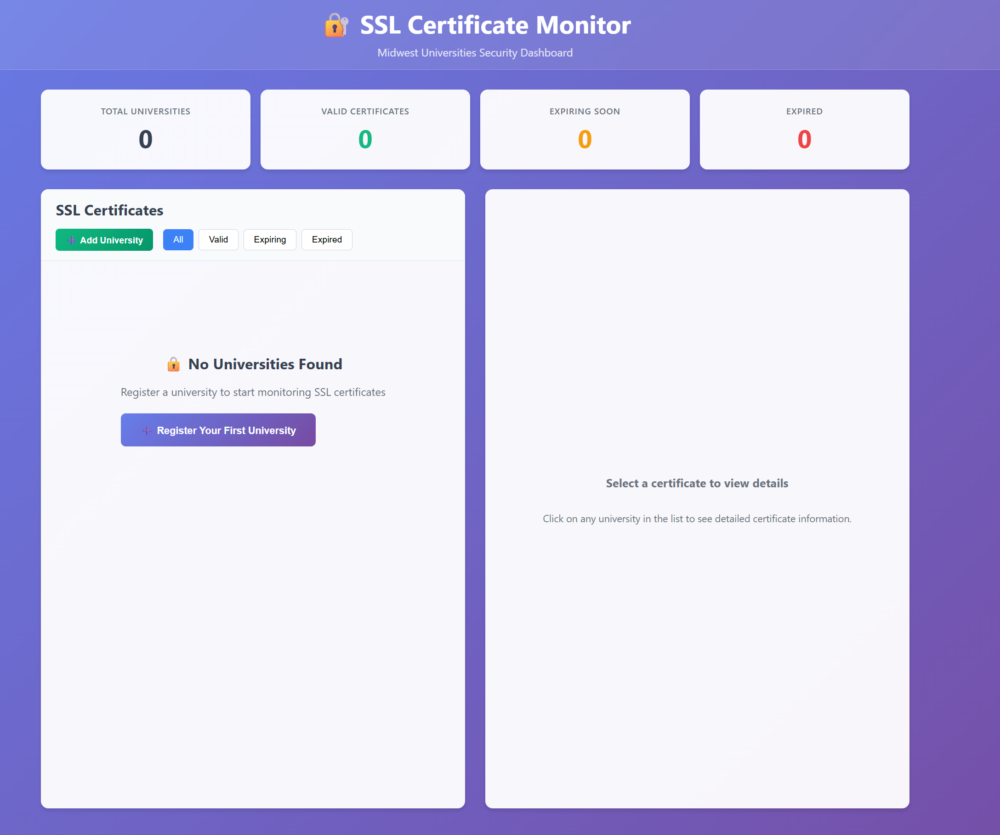
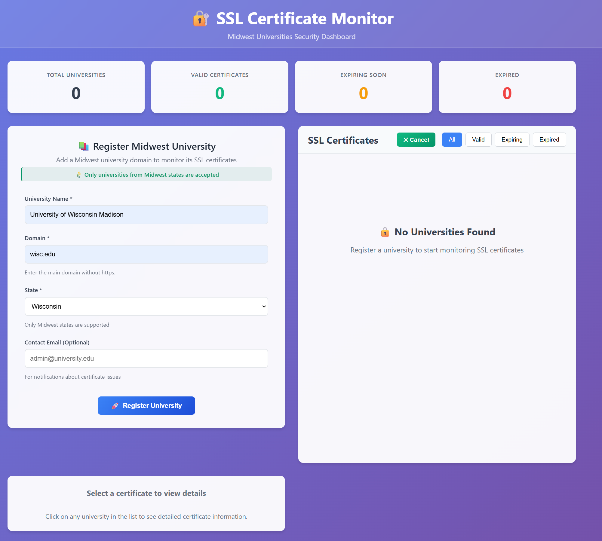
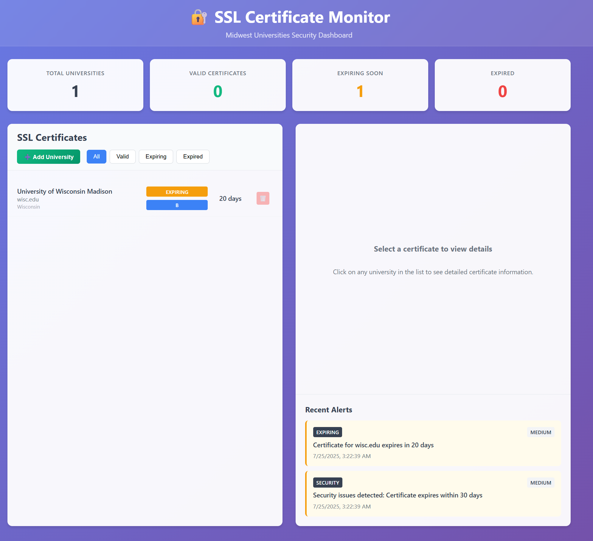
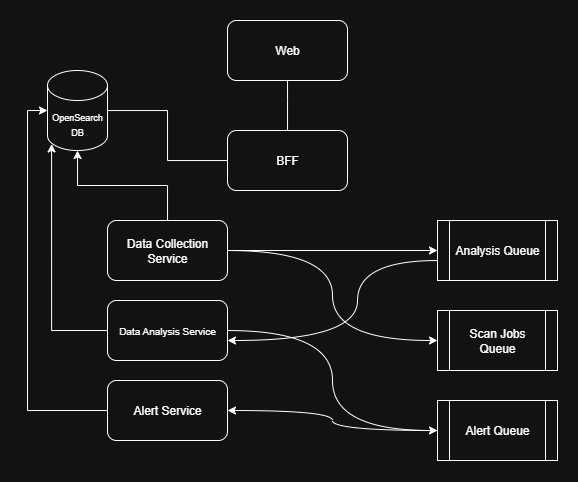

# University SSL Certificate Monitoring System

A comprehensive microservices-based system for monitoring SSL certificates across university domains, providing real-time analysis, alerting, and dashboard visualization.


## Key Features

- **Real-time Certificate Monitoring**: Automated scanning of university domain SSL certificates
- **Dashboard Analytics**: Comprehensive statistics showing certificate status distribution
- **University Registration**: Dynamic university domain management system
- **Smart Statistics**: Dashboard shows accurate data only for registered universities
- **Certificate Status Tracking**: Valid, expiring, expired, and invalid certificate monitoring
- **Security Grading**: A-F grading system for certificate security assessment
- **Alert Management**: Automated alerts for certificate issues and expiration
- **Responsive Design**: Mobile-friendly React interface
- **Microservices Architecture**: Scalable, containerized service architecture

## Application Screenshots

### Dashboard Overview

*Main dashboard showing university SSL certificate statistics and monitoring overview*

### University Registration

*University registration interface for adding new institutions to monitor*

### Certificate Details & Management

*Detailed certificate information and management interface*

## Architecture



The system consists of the following services:

- **Frontend**: React-based web interface
- **BFF (Backend for Frontend)**: API gateway and aggregation layer
- **Collection Service**: SSL certificate scanning and data collection
- **Analysis Service**: Certificate analysis and security grading
- **Alert Service**: Alert processing and notification management
- **OpenSearch**: Document database for certificate and alert storage
- **OpenSearch Dashboard**: Web interface for data visualization and management
- **Redis**: Message queue for inter-service communication

## CI/CD Pipeline

This project uses GitHub Actions for continuous integration and deployment:

- **Automated Testing**: Runs on every push and pull request
- **Frontend Deployment**: Automatically deploys to GitHub Pages on main branch
- **Backend Deployment**: Automatically deploys services to Heroku on main branch

## Quick Start

### Prerequisites
- Docker and Docker Compose
- Node.js 18+ (for local development)
- Git

### Running the System

1. **Clone the repository**
   ```bash
   git clone <repository-url>
   cd csca5028-final-project
   ```

2. **Start all services**
   ```bash
   docker-compose up -d
   ```

3. **Access the applications**
   - **Frontend Dashboard**: http://localhost:3000
   - **API**: http://localhost:4000
   - **OpenSearch Dashboard**: http://localhost:5601
   - **OpenSearch API**: http://localhost:9200
   - **Redis**: localhost:6379

### Service Ports

| Service | Port | Description |
|---------|------|-------------|
| Frontend | 3000 | React web interface |
| BFF API | 4000 | Main API gateway |
| Alert Service | 4001 | Alert processing |
| Analysis Service | 4002 | Certificate analysis |
| Collection Service | 4003 | Certificate scanning |
| OpenSearch | 9200 | Database API |
| OpenSearch Dashboard | 5601 | Data visualization |
| Redis | 6379 | Message queue |

## OpenSearch Dashboard

The OpenSearch Dashboard provides a powerful web interface for:

### Features
- **Index Management**: View and manage certificate and alert indices
- **Data Exploration**: Search and analyze certificate data
- **Visualizations**: Create charts and graphs of certificate metrics
- **Dashboards**: Build custom dashboards for monitoring
- **Dev Tools**: Execute queries and manage the cluster

### Accessing OpenSearch Dashboard

1. **Open your browser** and navigate to: http://localhost:5601
2. **Wait for initialization** (may take a few minutes on first startup)
3. **Start exploring** - no authentication required (security disabled for development)

### Initial Setup

1. **Configure Index Patterns**:
   - Go to "Stack Management" > "Index Patterns"
   - Create patterns for:
     - `certificates*` - for certificate data
     - `alerts*` - for alert data

2. **Import Sample Dashboards**:
   - Navigate to "Stack Management" > "Saved Objects"
   - Import dashboard configurations (if available)

3. **Create Visualizations**:
   - Certificate status distribution
   - Security grade breakdown by university
   - Alert trends over time
   - Expiring certificates timeline

### Useful Queries

#### View All Certificates
```json
GET certificates/_search
{
  "query": { "match_all": {} },
  "sort": [{ "scanTimestamp": { "order": "desc" } }]
}
```

#### Find Expiring Certificates
```json
GET certificates/_search
{
  "query": {
    "bool": {
      "must": [
        { "term": { "status": "expiring" } },
        { "range": { "daysUntilExpiry": { "lte": 30 } } }
      ]
    }
  }
}
```

#### Alert Summary
```json
GET alerts/_search
{
  "query": { "term": { "resolved": false } },
  "aggs": {
    "by_severity": {
      "terms": { "field": "severity" }
    }
  }
}
```

## Development

### Building Individual Services

```bash
# Build all services
npm run build

# Build specific service
cd alert-service && npm run build
```

### Running Tests

```bash
# Run tests for specific service
cd alert-service && npm test
```

## API Endpoints

### University Management
- `GET /api/universities` - List all registered universities
- `POST /api/universities/register` - Register a new university
- `GET /api/universities/:domain` - Get university details by domain
- `PUT /api/universities/:domain` - Update university information
- `DELETE /api/universities/:domain` - Remove university registration

### Certificate Management
- `GET /api/certificates` - List all certificates for registered universities
- `GET /api/certificates/:domain` - Get certificate for specific domain
- `POST /api/certificates/scan/:domain` - Trigger manual scan

### Alerts
- `GET /api/certificates/alerts/recent` - Get recent unresolved alerts

### Dashboard
- `GET /api/certificates/stats/dashboard` - Get dashboard statistics for registered universities only

### Dashboard Statistics Response
```typescript
{
  totalUniversities: number,        
  validCertificates: number,        
  expiringCertificates: number,     
  expiredCertificates: number,     
  securityDistribution: {           
    'A': number,
    'B': number,
    'C': number,
    'D': number,
    'F': number
  },
  recentAlerts: Alert[]            
}
```

> **Note**: Statistics are calculated only for registered universities. When no universities are registered, all values return 0.

## Monitoring and Debugging

### OpenSearch Health Check
```bash
curl http://localhost:9200/_cluster/health
```

### Redis Connection Test
```bash
docker exec -it <redis-container> redis-cli ping
```

### View Service Logs
```bash
docker-compose logs -f <service-name>
```

### OpenSearch Dashboard Health
- Navigate to http://localhost:5601/status
- Check cluster and indices status

## Data Models

### University Document
```typescript
{
  domain: string,              
  name: string,               
  registrationDate: string,  
  isActive: boolean          
}
```

### Certificate Document
```typescript
{
  university: string,         
  domain: string,            
  state: string,            
  issuer: string,           
  subject: string,          
  validFrom: string,        
  validTo: string,          
  daysUntilExpiry: number,  
  serialNumber: string,     
  signatureAlgorithm: string, 
  keySize: number,          /
  securityGrade: 'A' | 'B' | 'C' | 'D' | 'F', 
  status: 'valid' | 'expiring' | 'expired' | 'invalid', 
  scanTimestamp: string     
}
```

### Alert Document
```typescript
{
  id: string,
  type: 'expiring' | 'expired' | 'security' | 'error',
  university: string,
  domain: string,
  message: string,
  severity: 'critical' | 'high' | 'medium' | 'low',
  timestamp: string,
  resolved: boolean
}
```

## Testing

This project includes comprehensive unit and integration tests for all components.

### Test Structure

```
project/
├── frontend/src/
│   ├── App.test.tsx                           # App component tests
│   ├── components/
│   │   ├── Dashboard.test.tsx                 # Dashboard component tests
│   │   └── UniversityRegistration.test.tsx   # Registration form tests
│   └── setupTests.ts                          # Test setup configuration
├── alert-service/tests/
│   ├── unit/
│   │   └── alerter.test.ts                    # Alert processor unit tests
│   └── integration/
│       └── alert-service.test.ts              # Redis & OpenSearch integration
├── analysis-service/tests/
│   ├── unit/
│   │   └── analyzer.test.ts                   # Certificate analyzer unit tests
│   └── integration/
│       └── analysis-service.test.ts           # Service integration tests
├── collection-service/tests/
│   ├── unit/
│   │   └── scanner.test.ts                    # Certificate scanner unit tests
│   └── integration/
│       └── collection-service.test.ts         # Scanning integration tests
└── bff/tests/
    ├── unit/
    │   └── database.test.ts                   # Database utility tests
    └── integration/
        └── api.test.ts                        # API endpoint tests
```

### Running Tests

#### Frontend Tests
```bash
# Navigate to frontend directory
cd frontend

# Install dependencies
npm install

# Run all tests
npm test

# Run tests with coverage
npm test -- --coverage --watchAll=false

# Run specific test file
npm test Dashboard.test.tsx
```

#### Backend Service Tests
```bash
# For each service (alert-service, analysis-service, collection-service, bff)
cd <service-directory>

# Install dependencies
npm install

# Run all tests
npm test

# Run only unit tests
npm run test:unit

# Run only integration tests
npm run test:integration

# Run tests in watch mode
npm run test:watch
```

### Continuous Integration

#### GitHub Actions
Tests run automatically on:
- **Pull Requests**: All tests must pass before merge
- **Push to main**: Full test suite execution
- **Scheduled runs**: Weekly dependency and integration tests

#### Test Reports
- **Coverage Reports**: Generated for each test run
- **Test Results**: Displayed in GitHub Actions
- **Failed Test Notifications**: Automatic alerts for test failures

### Debugging Tests

#### Frontend Debugging
```bash
# Debug specific test
npm test -- --testNamePattern="should handle form submission"

# Run tests with debugging info
npm test -- --verbose

# Generate test coverage report
npm test -- --coverage --coverageDirectory=coverage
```

#### Backend Debugging
```bash
# Debug with Node inspector
node --inspect-brk node_modules/.bin/jest --runInBand

# Run tests with detailed output
npm test -- --verbose --detectOpenHandles

# Test specific file pattern
npm test -- --testPathPattern="alerter"
```

### Test Data Management

#### Mock Data Structure
```typescript
// Example test certificate
const mockCertificate = {
  university: 'Test University',
  domain: 'test.edu',
  state: 'CO',
  issuer: 'DigiCert Inc',
  subject: 'CN=test.edu',
  validFrom: '2024-01-01T00:00:00Z',
  validTo: '2025-12-31T23:59:59Z',
  daysUntilExpiry: 365,
  serialNumber: '12345',
  signatureAlgorithm: 'SHA256withRSA',
  keySize: 2048,
  securityGrade: 'A',
  status: 'valid',
  scanTimestamp: new Date().toISOString()
};
```

#### Test Environment Setup
- **Isolated Databases**: Separate test indices in OpenSearch
- **Clean State**: Each test starts with clean database state
- **Predictable Data**: Consistent test data for reliable results
- **Performance**: Fast test execution with optimized setup/teardown

### Testing Commands Summary

```bash
# Run all tests across the project
npm run test --workspaces

# Test specific service
cd alert-service && npm test

# Frontend tests with coverage
cd frontend && npm test -- --coverage --watchAll=false

# Integration tests only
cd analysis-service && npm run test:integration

# Watch mode for development
cd bff && npm run test:watch
```

## Configuration

### Environment Variables

| Variable | Default | Description |
|----------|---------|-------------|
| OPENSEARCH_URL | http://localhost:9200 | OpenSearch cluster URL |
| REDIS_URL | redis://localhost:6379 | Redis connection string |
| PORT | Service-specific | Service port number |
| NODE_ENV | development | Environment mode |

## Troubleshooting

### Common Issues

1. **OpenSearch Dashboard not loading**
   - Check if OpenSearch is running: `curl http://localhost:9200`
   - Wait for cluster initialization (can take 2-3 minutes)
   - Check logs: `docker-compose logs opensearch-dashboard`

2. **Services can't connect to OpenSearch**
   - Ensure OpenSearch is healthy
   - Check network connectivity between containers
   - Verify environment variables

3. **No data in dashboard**
   - Register universities first using the registration form
   - Trigger certificate scans manually for registered domains
   - Check if collection service is running and scanning registered universities
   - Verify index creation in OpenSearch

4. **Dashboard showing zeros**
   - This is expected behavior when no universities are registered
   - Register at least one university to see certificate statistics
   - Wait for certificate scanning to complete (may take a few minutes)


### Development Workflow

1. **Local Development**: Use Docker Compose for full stack
2. **Testing**: Automated tests run in CI/CD pipeline
3. **Code Quality**: ESLint and TypeScript compilation checks
4. **Deployment**: Automatic deployment on main branch merge
